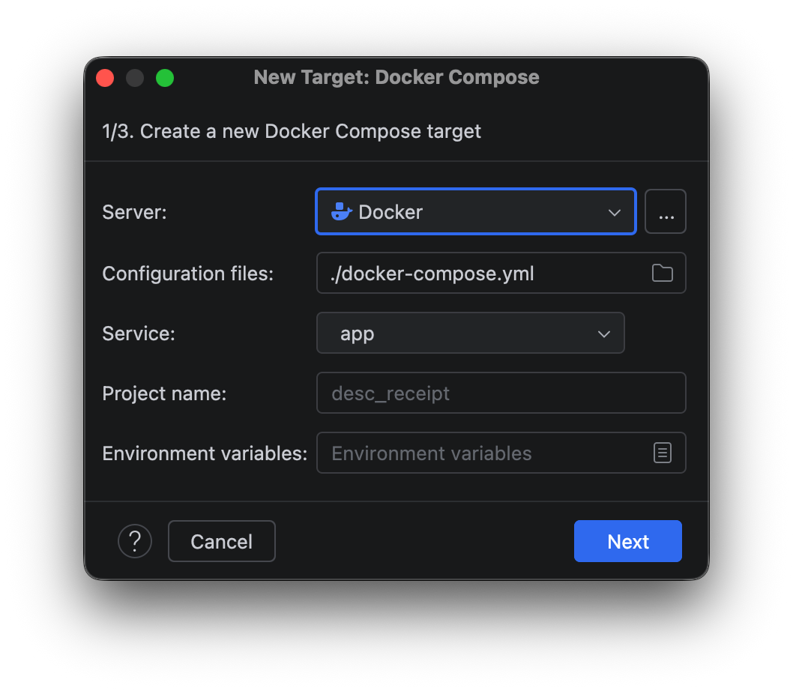
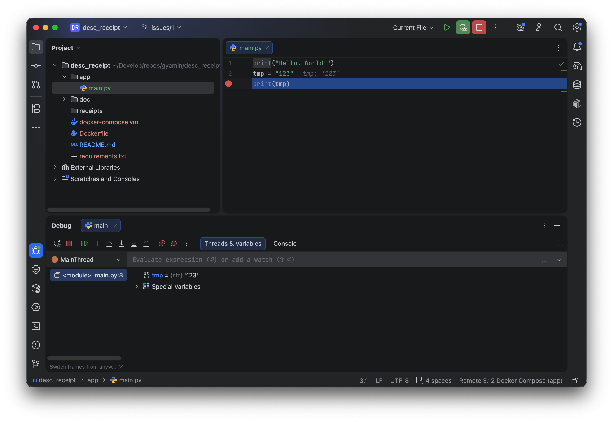

# How to prepare local development environment.

## Outline
- Python execution environment is given by docker container.

## Execute main.py
```
% docker compose up
 ✔ Container desc_receipt-app-1 Recreated                                                       0.1s
Attaching to app-1
app-1  | Hello, World!
app-1 exited with code 0
```

## Execution docker container on PyCharm.

### configure python interpreter.


### debug and execute main.py.


### Install pip packages.


